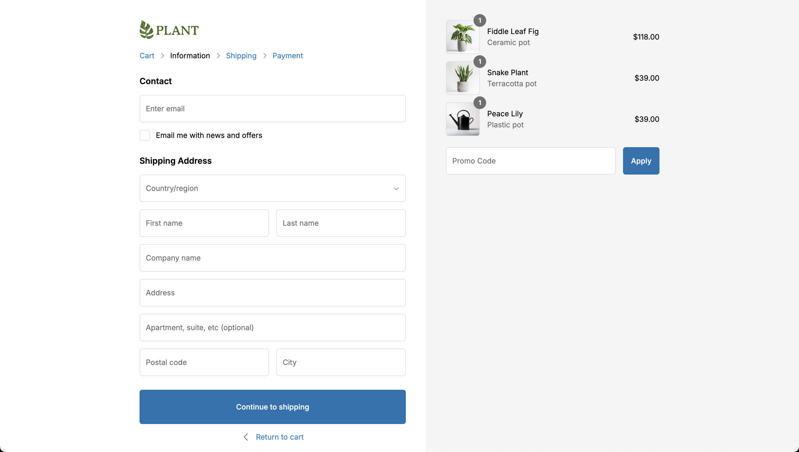
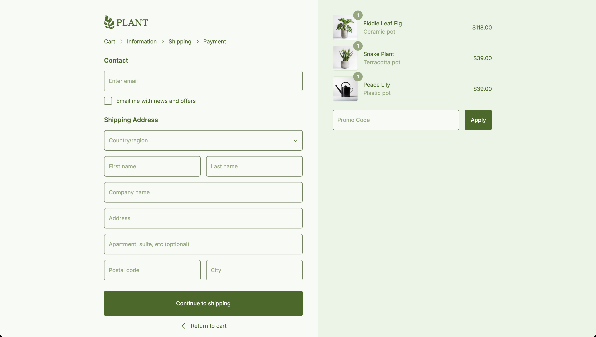

# Saleor Storefront

## Overview

I’m developing Saleor Storefront utilizing GraphQL data masking, the render-as-you-fetch pattern, partial pre-rendering, and streaming. For the UI components, I’m implementing React Aria. Additionally, the storefront features branding through CSS variables.

## Images

